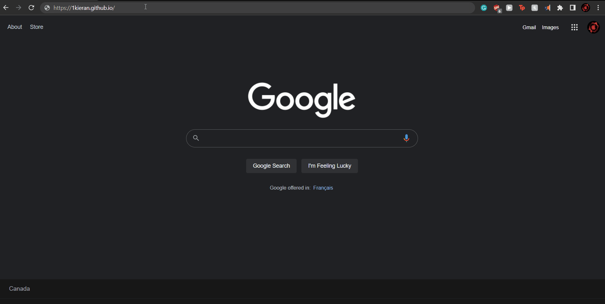

# **Hosting a Resume on GitHub**
***
## **Content**
***
  - [**Purpose**](#purpose)
  - [**Prerequisites**](#prerequisites)
  - [**Intro to Technical Writing**](#intro-to-technical-writing)
  - [**Instructions**](#instructions)
  - [**More Resources**](#more-resources)
  - [**Authors and Acknowledgments**](#authors-and-acknowledgments)
  - [**FAQ**](#faq)
***
## **Purpose**
***  
This document will serve as a guide on how to host a resume on GitHub. Additionally, this document will introduce the workflow of technical writing outlined in Andrew Etter's book [_Modern Technical Writing_][Andrew's Book]. Hosting a resume will serve as an example of how to apply Etter's principles. After completing this tutorial, the reader should be able to host a Markdown formatted resume with their GitHub profile.
***
## **Prerequisites**
***
1. A MarkDown formatted resume
2. A GitHub account

Information on how to get started with MarkDown and GitHub can be found in the [More Resources](#more-resources) section
***
## **Intro to Technical Writing**
***
_Modern Technical Writing_ outlines 8 steps of modern technical writing. They are as follows:
1. Don't Write 
2. Define the Audience
3. Basic Functional Documentation
4. Style
5. Catalog the Diff
6. Build a Website 
7. Help Others Write 
8. Publish Frequently  

The principle _don't write_ refers to the writers need to research before writing. Etter advises that writers become very familiar with their subject matter before beginning to write about it. This step requires that the write become something of an expert on the topic before starting the technical write up. The second principle _define the audience_ asks the writer to critically reflect on who they're writing for. This means understanding the need and issues the reader of the document are faced with when referring to the technical write up.  

In the case of writing a resume these steps are vitally important. These steps require the writer to understand the company they are applying to. What does this company need in an employee? What issues does this company face that the writer is unique suited to resolve? Additionally they must understand the audience they are writing for. What is the companies culture like? Are they formal or informal? What is the companies mission? These questions must be answers before writing the resume. As the resume itself is a prerequisite to this document, this guide will not go in to great detail about how to write a resume.  

The instruction section will outline the specifics of how to create a static website that follows the above principles.
***
## **Instructions**
***
Once the Prerequisites have been gather these instructions can be followed.  
1. Begin at your GitHub profile page
2. Go to the Repositories page 
3. Create a new Repository and title it "your-user-name.github.io" replacing "your-user-name" with your github user name
4. In this new repository add your resume
5. Change the file name of your resume to index.md
6. Add the below text to the top of your resume
```
   ---
   title: "new title"
   ---
```
replace new title with what ever you would like your resumes page to be called. The three lines on top and bottom indicate that this is Jekyll code. This Jekyll code is setting the static websites title.

7. Next create a new file called _config.yml this is the Jekyll configure file that will be used to style how your resume looks
8. In the [More Resources](#more-resources) section find the GitHub supported Jekyll themes
9.  Pick a theme from the list of supported themes. For example the cayman theme
10.  Return to the _config.yml file and add this line
```
  theme: jekyll-theme-cayman   
```
This example use cayman but this can be replace by any other GitHub supported Jekyll themes from the list found in [More Resources](#more-resources)

11.  The static website is now ready to be run simple go the domain "your-user-name.github.io" replacing your-user-name with your GitHub user name. GitHub pages has turned your index.md file into xml and then the Jekyll theme uses CSS and Javascript to stylize your page.

Here is an example with cayman styling

 
***
## **More Resources**
***
* [How to work on MarkDown with VSCode][MarkDown VSCode]
* [Getting Started with writing MarkDown][MarkDown tutor]
* [Create a GitHub Account][GitHub Create]
* [GitHub Introduction Course][GitHub Intro]
* [Andrew Etter's book][Andrew's Book]
* [GitHub Supported Jekyll Themes][GitHub Themes]

***
## **Authors and Acknowledgments**
***
* [Credit to Cayman theme][Cayman Theme]
* 
***
## **FAQ**
***
1. Why is Markdown better than a word 
processor?

Markdown allows us to use tools like Jekyll to quickly change the styling of our document as well as markdown easily translates in to XML. Word lacks both of these features.  

2. Why does is my static site not displaying the changes i made to my styling or content?

GitHub can take awhile to sync up old files with new ones. Try checking again in a few minutes.


[MarkDown VSCode]: https://code.visualstudio.com/docs/languages/markdown
[MarkDown tutor]: https://www.markdowntutorial.com
[Andrew's Book]: https://www.amazon.ca/Modern-Technical-Writing-Introduction-Documentation-ebook/dp/B01A2QL9SS
[GitHub Create]: https://github.com/join
[GitHub Intro]: https://lab.github.com/githubtraining/introduction-to-github
[GitHub Themes]: https://pages.github.com/themes/
[Cayman Theme]: https://github.com/pages-themes/cayman